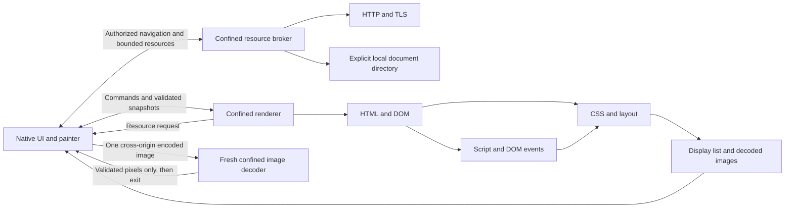

# Engine and process layout

The HTML parser, DOM, CSS cascade, layout, script interpreter, SVG geometry and
software display-list painter are implemented in this repository. HTTP/TLS,
URL/encoding handling, font outlines, image codecs, windowing and OS sandbox
wrappers are infrastructure dependencies. No external browser or JavaScript
engine executes a page.

The native UI owns address entry, history, clipboard, window events and the final
pixel surface. A document navigation creates a new renderer; its first resource
request starts a separate broker. Both children have cleared environments,
checked inherited descriptors, Linux confinement and resource limits. The
renderer cannot directly open resource files or create sockets. The `--render`
and `--benchmark` CLI modes and library entry points use the page pipeline in
their calling process. The separate `--benchmark-worker` mode uses the confined
worker/broker boundary without opening a desktop window.

The parent authorizes the initial URL and optional form body. The broker allows
that document fetch once, validates redirects, and uses the final document URL
as the initiator for later resource requests. The parent remembers that URL and
rejects snapshots which claim a different document. Renderer requests cannot
supply their own initiator or file grant. Network scripts and styles require
the committed origin, including redirects. Cross-origin images use a fresh
decoder process with no file or socket access. The renderer receives pixels and
origin provenance, while the parent withholds the encoded response, headers,
status and final URL. The decoder exits after one image and is never reused
across origins. Same-origin images and inline SVG remain in the renderer.

Within the renderer, `Page` loads resources, parses HTML, runs the supported
script subset and computes styles/layout. The DOM stores HTML, SVG and MathML
namespace identity. Inline SVG is rasterized into the page's image store.
HTML templates own separate hosted document fragments, which ordinary document
queries and layout do not traverse. Cloning and fragment transfer preserve that
distinction. Documents retain their parsing mode and canonical character encoding;
fragment parsing inherits the owner's context.
Interaction requests update the same document and interpreter, then return a
new snapshot. A shared DOM control policy governs both native editor focus and
page edits; navigation generations and edit acknowledgements prevent stale
results from replacing newer input.

Snapshots contain the DOM, display list, hit regions, shared raster images and
page metadata. The parent checks their graph structure, namespace bindings,
storage limits, geometry and raster dimensions before publishing them to the
UI. The ERW8 format also validates reciprocal template/fragment ownership,
host-inclusive cycles/depth, canonical encoding metadata, frozen base URLs, fixed hit coordinates, generated-summary action hints and typed clip/fixed/opacity display scopes. Generated-summary hints require an active, visible HTML details element without an authored direct summary. Resource traffic has separate request/response messages. All pipe channels
use bounded framing, nonblocking I/O and deadlines; cancellation remains latched
across nested broker and decoder exchanges. Failure or replacement kills and reaps the
corresponding children.

Snapshots report an explicit idle, pending or suspended task state. While a
document has pending disclosure notifications, the native bridge waits on its
interruptible request condition with a 16 ms deadline, then sends `RunTasks`
and renders another snapshot. Queued input, navigation and shutdown take
precedence; the timer adds no request backlog. Each batch retains the shared
100,000-step/64-notification limit. A checkpoint failure suspends automatic
dispatch until document replacement, retaining unstarted notifications and
preventing repeated attempts against an exhausted allocation budget. Task
callbacks refresh inline SVG even after partial mutation followed by failure.
`Render` runs no author callbacks. Headless/library callers can explicitly use
`Page::run_pending_tasks`; CLI renders and benchmarks retain their fixed
post-load checkpoint. This is an idle continuation mechanism for disclosure
tasks, not the complete HTML event loop, timers or a microtask implementation.

The painter runs in the UI and draws validated commands with bundled fonts and
a glyph cache. Fixed scopes retain viewport coordinates and reset document ancestor clips to the caller viewport clip; both native and headless scrolling keep these offsets separate. Scrolling reuses the display list; edits currently recompute
styles and layout. Rendering is CPU based, without a GPU compositor or general
incremental invalidation. The `--benchmark` warm-render loop excludes process
startup, resource transfer and snapshot serialization. The separate
`--benchmark-worker` mode uses the same confined worker and validated snapshots
as the native browser, measuring startup, load, render round trips, parent
software paint and teardown separately. It excludes the window event loop and
native presentation; neither mode measures the complete native path.

HTML byte decoding chooses a BOM, transport charset, or bounded markup prescan,
with windows-1252 as the current locale-independent fallback. A later accepted
declaration can trigger one reparse of the cached response before resource loading
or script execution; it never repeats the navigation request. CSS and classic
scripts select their own encodings using the referring document as a fallback.
The string-based DOM APIs already receive Unicode and never reinterpret bytes.
See [encoding behavior](ENCODING.md) for precedence, tests and remaining limits.

Document base URL metadata changes resolution without changing fetch authority.
Stylesheet imports retain separate parse inputs, shared layer identities and structured media conditions;
cycles, repeated scans, URL copies/cache storage and expanded source all have
shared limits. The custom RegExp parser and explicit backtracking matcher use
runtime work/allocation limits and introduce no external execution engine.

Media-query conditions use bounded recursive evaluation with unknown-value
logic and share work across stylesheet sources. Flex layout forms row or column
lines, resolves flexible sizes per line, and distributes their cross sizes before
item alignment. Untagged JavaScript templates use parser-selected lexical goals
and a flat sequence of UTF-16 segments/substitutions; each substitution is
converted to text before the next expression runs. All three paths retain the
existing parser, layout and runtime resource boundaries.

See [security](SECURITY.md) for exact grants, limits and remaining attack surface,
[compatibility](COMPATIBILITY.md) for implemented subsets, and
[validation](VALIDATION.md) for observed test results. These boundaries are
implementation facts, not a claim of complete standards support or audited
security.

CSS layer registration spans all source segments before cascade ranking. Event objects keep private runtime state separate from script-visible properties; synchronous dispatch fixes the path before callbacks and shares script quotas. Abort signals retain private reasons and charged listener IDs, removing listeners before dispatching their abort event. Opacity groups are emitted after stacking order and painted into bounded premultiplied RGBA16 intermediates, allocated on the first visible source pixel and then composited once into their parent. The native protocol validates opacity values and typed scope nesting before UI painting.
